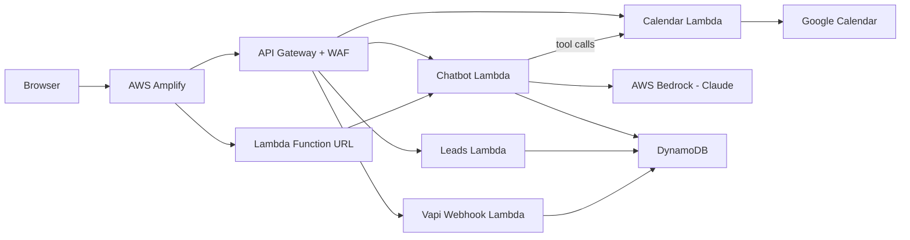

# Unkommon

Custom AI/ML engineering studio — production-grade AI systems on AWS.


**Live:** [unkommon.ai](https://unkommon.ai)

## Architecture

```
Browser
  │
  ├── React SPA (AWS Amplify)
  │     ├── AI Chatbot with streaming SSE
  │     ├── Voice AI demo (Vapi)
  │     └── Admin dashboard (Cognito auth)
  │
  └── API Gateway (WAF rate-limited)
        ├── POST /api/chat ──────── Claude on Bedrock (tool-calling)
        ├── GET/POST /api/calendar ─ Google Calendar API
        ├── GET/DELETE /api/leads ── DynamoDB (Cognito-protected)
        ├── POST /api/vapi-webhook ─ HMAC-verified voice webhooks
        └── POST /api/contact ───── SES transactional email
```



## Features

**AI Chatbot** — Conversational assistant powered by Claude (Sonnet 4.5 / Haiku 4.5) on AWS Bedrock. Supports multi-turn conversations with DynamoDB persistence (24h TTL), real-time streaming via SSE through Lambda Function URLs, and tool-calling for calendar availability checks and appointment booking.

**Voice AI** — Inbound phone receptionist via Vapi with HMAC-verified webhooks, automatic lead capture, and calendar integration. Processes end-of-call reports to extract structured data (name, email, phone) and book follow-up appointments.

**Calendar Integration** — Google Calendar API with service account domain-wide delegation. Checks real-time availability, books appointments with conflict detection, generates Google Meet links, and sends branded HTML confirmation emails via Resend.

**Admin Dashboard** — Cognito-authenticated leads management interface. JWT validation at the Lambda level. Full CRUD on lead data with stats aggregation.

## Tech Stack

| Frontend | Backend | Infrastructure |
|----------|---------|----------------|
| React 18 + TypeScript | Python 3.13 | AWS SAM (IaC) |
| Vite | AWS Lambda (5 functions) | API Gateway + WAF |
| Tailwind CSS | AWS Bedrock (Claude) | DynamoDB (2 tables) |
| Framer Motion | Google Calendar API | AWS Cognito |
| Radix UI / shadcn | Resend (email) | AWS Secrets Manager |
| Wouter (routing) | Vapi AI (voice) | AWS Amplify (hosting) |
| Three.js (globe) | boto3 / requests | SES (transactional email) |

## Project Structure

```
.
├── frontend/                React SPA
│   ├── src/
│   │   ├── components/      UI components (ChatWidget, HeroBackground, etc.)
│   │   ├── pages/           Route pages (home, solutions, contact, admin)
│   │   ├── hooks/           Custom hooks
│   │   └── lib/             Utilities and config
│   ├── public/              Static assets
│   └── package.json
│
├── backend/                 AWS SAM serverless API
│   ├── chatbot/             AI chatbot (Bedrock + tool-calling)
│   │   ├── app.py           Standard request handler
│   │   └── stream.py        SSE streaming handler
│   ├── calendar_api/        Google Calendar integration
│   ├── leads_api/           Admin dashboard API (Cognito JWT auth)
│   ├── vapi_webhook/        Voice call webhook processor
│   ├── contact_form/        Contact form handler
│   └── template.yaml        SAM infrastructure definition
│
├── amplify.yml              Amplify build config + security headers
├── CLAUDE.md                AI assistant project context
└── LICENSE
```

## Getting Started

### Prerequisites

- Node.js 18+
- Python 3.13
- AWS SAM CLI
- AWS account with Bedrock access

### Frontend

```bash
cd frontend
cp .env.example .env       # Fill in your API URLs and keys
npm install
npm run dev                # Dev server on :3000
```

### Backend

```bash
cd backend
sam build
sam deploy --guided        # First deploy (creates resources + prompts for parameters)
```

Required SAM parameters: `VapiWebhookSecret`, `ResendApiKey`, `CognitoUserPoolId`.

## Security

This project implements defense-in-depth:

- **Authentication** — Cognito JWT validation on admin endpoints, HMAC signature verification on webhooks
- **Rate limiting** — AWS WAF per-IP rules (100 req/5min global, 30 req/5min on chatbot), plus application-level rate limiting on booking
- **Input validation** — Server-side tool parameter validation independent of LLM output, UUID format enforcement, email/date/phone regex validation
- **CORS** — Restricted to production origin (not wildcard)
- **Headers** — HSTS, CSP, X-Frame-Options: DENY, X-Content-Type-Options, Permissions-Policy, Referrer-Policy
- **Secrets** — AWS Secrets Manager for credentials, SAM NoEcho parameters, no hardcoded secrets
- **Data** — DynamoDB parameterized queries, HTML escaping in email templates, 24h TTL on conversation data

## Deployment

| Component | Platform | Trigger |
|-----------|----------|---------|
| Frontend | AWS Amplify | Git push to `main` |
| Backend | AWS SAM | `sam build && sam deploy` |
| WAF | AWS WAFv2 | Attached via CLI post-deploy |

## License

MIT License. See [LICENSE](LICENSE).
